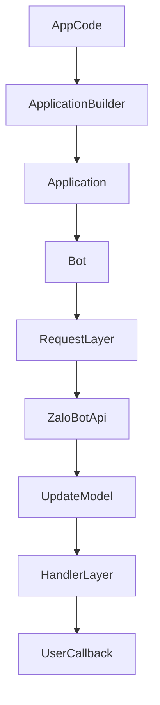

# Architecture

## Overview

The SDK is currently organized into clear layers:

- `src/request`: HTTP transport and API error mapping
- `src/models`: payload parsing for `User`, `Chat`, `Message`, `Update`, `WebhookInfo`
- `src/core`: `Bot`, `Application`, `ApplicationBuilder`, `CallbackContext`
- `src/handlers`: command and message handling
- `src/filters`: composable update filters

## Runtime flow

## Porting direction

This project is based on the `python_zalo_bot` reference package, but it is not a mechanical port. The TypeScript version intentionally simplifies Python-specific patterns:

- no `__slots__` or sentinel default wrappers
- explicit `initialize()` and `shutdown()` lifecycle
- lighter TypeScript-native models and parsers
- fallback parsing for thin API message responses

## Current limitations

- no full multipart media abstraction yet
- no worker queue layer yet
- no framework-specific webhook adapters packaged separately
