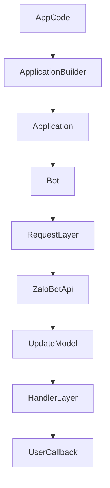

# Kiến trúc

## Tổng quan

SDK hiện tại được chia theo các lớp rõ ràng:

- `src/request`: xử lý HTTP transport và map lỗi API
- `src/models`: parse payload thành `User`, `Chat`, `Message`, `Update`, `WebhookInfo`
- `src/core`: `Bot`, `Application`, `ApplicationBuilder`, `CallbackContext`
- `src/handlers`: xử lý command và message
- `src/filters`: các bộ lọc có thể kết hợp

## Luồng chạy cơ bản

## Mapping từ Python sang TypeScript

Project này được tham chiếu từ `python_zalo_bot`, nhưng không copy cơ học. Một số phần đã được đơn giản hóa:

- bỏ các pattern Python-only như `__slots__`, sentinel defaults, freeze object
- giữ lifecycle rõ ràng qua `initialize()` và `shutdown()`
- ưu tiên object và parser TypeScript gọn hơn
- fallback parse cho response gửi tin nhắn nếu API trả payload mỏng

## Giới hạn hiện tại

- chưa có media upload abstraction đầy đủ
- chưa có worker queue layer
- webhook framework adapters chưa tách thành package riêng
